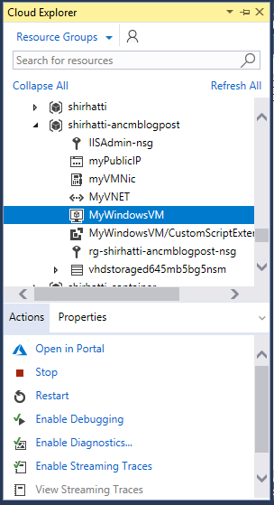

# ASP.NET Core Module 2.1-preview1

The ASP.NET Core Module (ANCM) is a global IIS module that has been responsible for proxying requests over from IIS to your backend ASP.NET application running Kestrel.
Since 2.0 we have been hard at work to bring to two major improvements to the ANCM: version agility and performance.

### Version agility

It has been hard to iterate on ANCM since we've had to ensure forward and backward compatibility between every version of ASP.NET Core and ANCM that has shipped thus far.
To mitigate this problem going forward, we've refactored our code into two separate components- the ASP.NET Core Shim (shim) and the ASP.NET Core Request Handler (request handler). The shim (aspnetcore.dll) as the name suggests is just a lightweight shim where as the request handler (aspnetcorerh.dll) does all the heavy lifting.
Going forward, the shim will ship globally and will continue to be installed via the Server Hosting Bundle. The request handler (aspnetcorerh.dll) will ship via a new NuGet package- Microsoft.AspNetCore.Server.IIS which you can directly reference in your application or consume via the ASP.NET metapackage or shared runtime.

### Performance

In addtion to the packaging changes, ANCM also adds supports for an in-process hosting model. Instead of serving as a reverse-proxy, ANCM can now boot the CoreCLR and host your application inside the IIS worker process. Our prelimnary performance tests have shown that this model delivers 4.4x the request throughput compared to hosting your dotnet application out-of-process and proxying over the requests.

## How do I try it?

If you have already installed the [2.1.0-preview1 ServerHosting bundle](https://download.microsoft.com/download/A/B/1/AB1AA972-8F2F-43AD-9A81-72E9245CB0F5/dotnet-hosting-2.1.0-preview1-final-win.exe), you can install the latest ANCM by running this [script](https://raw.githubusercontent.com/shirhatti/ANCM-ARMTemplate/95d5db59de5d56552ef70992759bd08c9cba9ff5/install-ancm.ps1).

```powershell
Invoke-WebRequest -Uri https://raw.githubusercontent.com/shirhatti/ANCM-ARMTemplate/95d5db59de5d56552ef70992759bd08c9cba9ff5/install-ancm.ps1 -OutFile install-ancm.ps1
.\install-ancm.ps1
```

Alternatively, you can deploy an Azure VM which is already setup with the latest ANCM by clicking the [Deploy to Azure](https://portal.azure.com/#create/Microsoft.Template/uri/https%3A%2F%2Fraw.githubusercontent.com%2Fshirhatti%2FANCM-ARMTemplate%2Fmaster%2Fazuredeploy.json) button below.

<a href="https://portal.azure.com/#create/Microsoft.Template/uri/https%3A%2F%2Fraw.githubusercontent.com%2Fshirhatti%2FANCM-ARMTemplate%2Fmaster%2Fazuredeploy.json" target="_blank">
    
</a>
<a href="https://armviz.io/#/?load=https%3A%2F%2Fraw.githubusercontent.com%2Fshirhatti%2FANCM-ARMTemplate%2Fmaster%2Fazuredeploy.json" target="_blank">
    
</a>

## Create a new project or update your existing project

Now that we have an environment to publish to, let's create a new application that targets 2.1.0-preview1 of ASP.NET Core.
Alternatively, you can upgrade an existing project by following the instructions on [this blog post](https://blogs.msdn.microsoft.com/webdev/2018/02/27/asp-net-core-2-1-0-preview1-now-available/).

## Modify your project

Let's go ahead and modify our project by setting a ProjectProperty to indicate that we want to our published application to be run inprocess.

Add this to your csproj

```xml
  <PropertyGroup>
    <AspNetCoreModuleHostingModel>inprocess</AspNetCoreModuleHostingModel>
  </PropertyGroup>
```

## Publish your project

Create a new publish profile and select the Azure VM that you just created. If you're using Visual Studio, you can easily publish to the Azure VM you just created. In the **Solution Explorer**, right-click the project and select **Publish** to open the Publish wizard where you can choose to publish to an Azure VM that you just created.


You may need to allow WebDeploy to publish to a server using an untrusted certificate. This can be accomplished by adding the following attribute to your publish profile (**.pubxml** file)

```xml
<PropertyGroup>
  ...
  <AllowUntrustedCertificate>True</AllowUntrustedCertificate>
</PropertyGroup>
```

If you're running elsewhere, go ahead publish your app to a Folder and copy over your artifacts or publish directly via WebDeploy.

### `web.config`

As part of the publish process, the WebSDK will read the `AspNetCoreModuleHostingModel` property and transform your *web.config* to look something like this. (Note: The new hostingModel attribute)

```xml
<?xml version="1.0" encoding="utf-8"?>
<configuration>
  <system.webServer>
    <handlers>
      <add name="aspNetCore" path="*" verb="*" modules="AspNetCoreModule" resourceType="Unspecified" />
    </handlers>
    <aspNetCore processPath="dotnet" arguments=".\newapp.dll" stdoutLogEnabled="false" stdoutLogFile=".\logs\stdout" hostingModel="inprocess" />
  </system.webServer>
</configuration>
```

## Debugging

> To view the Cloud Explorer, select **View** > **Cloud Explorer** on the menu bar.

If you've been following along using an Azure VM, you can enable remote debugging on your Azure VM via the cloud explorer. In the **Actions** tab associated with your VM, you should be able to **Enable Debugging**.



Once you've enabled remote debugging, you should be able to attach directly to the w3wp.exe process. If you don't see the process listed, you may need to send a request to your server to force IIS to start the worker process.

If you've been following along locally, you can use Visual Studio to attach a be directly to your IIS worker process and debug your application code running in the IIS worker process as shown below. (You may be prompted to restart Visual Studio as an Administrator for this).

> We don't yet have an experience for debugging with IIS Express. At the moment, you will have to publish to IIS and then attach a debugger.


## Switching between in-process and out-of-process

Switching hosting models can be deployment-time decision. To change between hosting models, all you have to do is change the `hostingModel` attribute in your web.config from `inprocess` to `outofprocess`.

```csharp
app.Run(async (context) =>
{
    var processName = Process.GetCurrentProcess().ProcessName;
    await context.Response.WriteAsync($"Hello World from {processName}");
});
```

It can be easily observed in this simple app where you'll observe either `Hello World from dotnet` or `Hello World from w3wp` based on your hosting model.